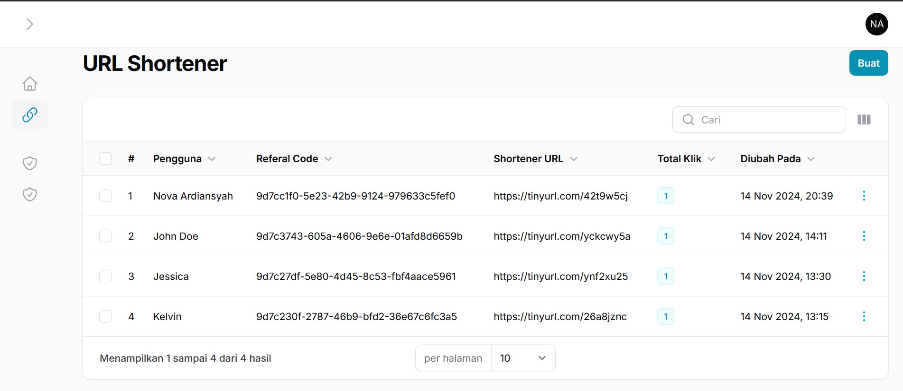
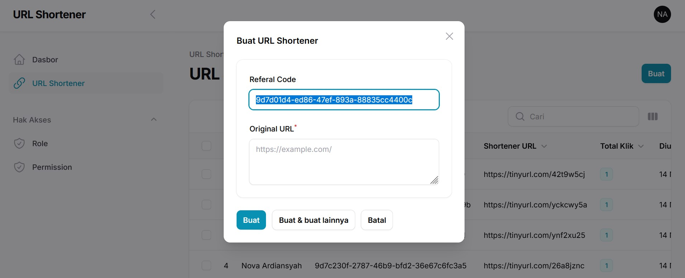
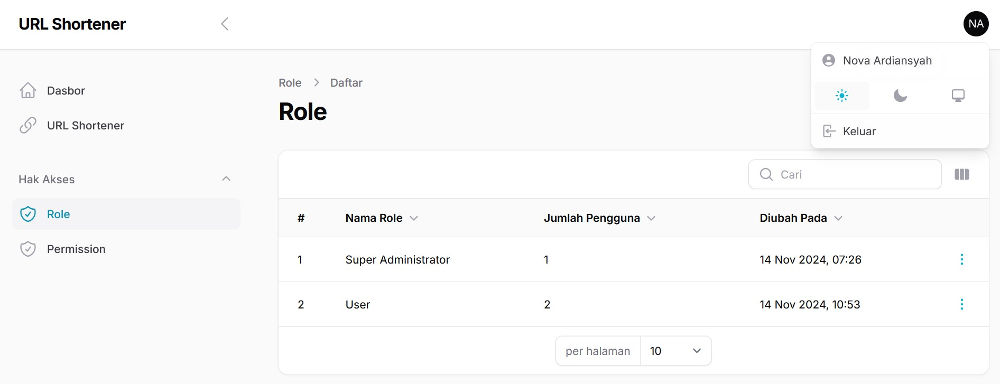
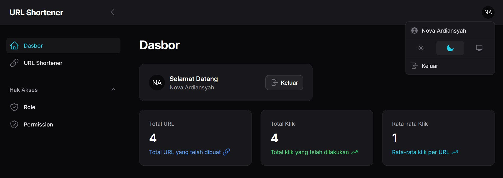

# Filament URL Shortener

Hi Future Developer,

Welcome to my latest project! This time, I’m working on a web-based application focused on creating short URLs. I’m using the latest technologies, like Laravel 11 and Filament 3, which I’ve been working with quite a bit recently.

The main goal of this app is to make it easy for users to create short URLs for sharing information or links that are shorter and easier to remember. Additionally, the app tracks and stores stats on how many times each URL is visited.

This project is open-source, so anyone who needs it can use it. I’ve also provided complete documentation on how to use the app. There’s still plenty of room for improvement, so if you have any constructive feedback or suggestions, I’d really appreciate it.

## How the Application Works

In this app, I’m using an Open API from [api.tinyurl.com](https://api.tinyurl.com/) to create short URLs, but I’ve added an additional layer in between to track URL activity stats directly within my app. The mechanism works by converting the original URL into a Referrer URL (which is the URL of my app) before using the API to shorten it.

The purpose of this additional layer is to make the URLs user-based, so even if the original URL is the same, converting it into different Referrer URLs results in unique short URLs. This way, I can gather separate activity stats for each URL.

I’m also planning to add a private URL feature, where a generated URL can be locked and accessed only by the user who created it. This is one of the main reasons I’m implementing the Referrer URL layer.

## Electrifying Tech Stack!⚡

This project is fueled by an electrifying lineup of cutting-edge technologies:

- [Laravel 11](https://laravel.com/docs/11.x)
- [Filament 3](https://filamentphp.com/docs/3.x)
- [Spatie Roles & Permissions](https://filamentphp.com/plugins/tharinda-rodrigo-spatie-roles-permissions)

Prepare for an exhilarating ride through innovation and efficiency with this impressive tech stack!

## Licensing Groove🕺

Exciting news! This project is grooving to the rhythm of the [MIT License](https://github.com/novaardiansyah/filament-url-shortener/blob/main/LICENSE)! 🎉

## Let's Connect! 📞

Need to chat? Feel free to drop me a line via [Email](mailto:novaardiansyah78@gmail.com) or hit me up on [WhatsApp](https://wa.me/6289506668480?text=Hi%20Nova,%20I%20have%20a%20question%20about%20your%20project%20on%20GitHub:%20https://github.com/novaardiansyah/filament-url-shortener). I'm just a message away, ready to groove with you! 📩

## Sneak Peek 🌟

Get a glimpse of the app's enchanting world by exploring the current progress at [live demo](https://short-url.tple008.my.id/). Feast your eyes on these snapshots that showcase the app's dynamic essence:

  
  

  
  

## Project Status 🚀 

